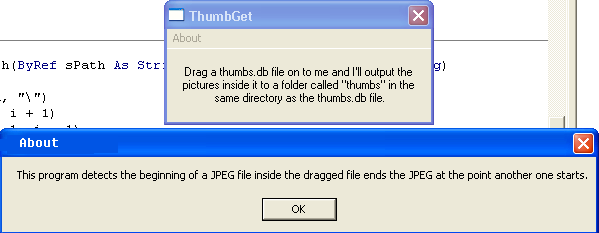



## ThumbGet Windows XP Thumbs\.db image media thumbnail file extractor

### Description

Ever noticed those thumbs.db files that pop up in folders which contain media files when you're using Windows XP? That file contains thumbnails of all the images that have been in that directory for quick access when you open that window and select a file whose image has been thumbnailed. This program extracts those images from thumbs.db. NOTE: this does not work on any other version of windows (except, perhaps longhorn? [vista is a dumb name])
 
### More Info
 

             |
---                |---
**Submitted On**   |2005-11-03 16:27:06
**By**             |[r\_t](https://github.com/Planet-Source-Code/PSCIndex/blob/master/ByAuthor/r-t.md)
**Level**          |Beginner
**User Rating**    |4.7 (14 globes from 3 users)
**Compatibility**  |VB 6\.0
**Category**       |[Graphics](https://github.com/Planet-Source-Code/PSCIndex/blob/master/ByCategory/graphics__1-46.md)
**World**          |[Visual Basic](https://github.com/Planet-Source-Code/PSCIndex/blob/master/ByWorld/visual-basic.md)
**Archive File**   |[ThumbGet\_W1945811132005\.zip](https://github.com/Planet-Source-Code/r-t-thumbget-windows-xp-thumbs-db-image-media-thumbnail-file-extractor__1-63142/archive/master.zip)

